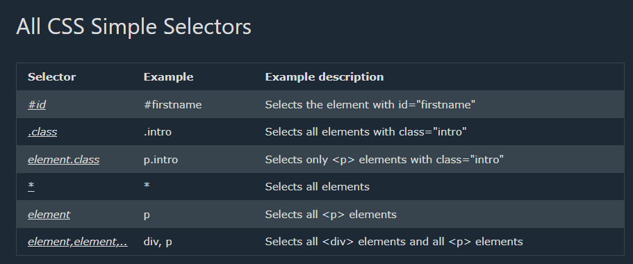

<h1>1. CSS Selectors</h1>
CSS Selectors
CSS selectors are used to "find" (or select) the HTML elements you want to style.

We can divide CSS selectors into five categories: 

Simple selectors (select elements based on name, id, class) 
Combinator selectors (select elements based on a specific relationship between them) 
Pseudo-class selectors (select elements based on a certain state) 
Pseudo-elements selectors (select and style a part of an element) 
Attribute selectors (select elements based on an attribute or attribute value) 
 
<h3>Simple Selectors</h3>
 

The CSS id Selector
The id selector uses the id attribute of an HTML element to select a specific element.
The id of an element is unique within a page, so the id selector is used to select one unique element!
To select an element with a specific id, write a hash (#) character, followed by the id of the element.

 
The CSS class Selector
The class selector selects HTML elements with a specific class attribute.
To select elements with a specific class, write a period (.) character, followed by the class name.

 
The CSS Universal Selector
The universal selector (*) selects all HTML elements on the page.

 
The CSS Grouping Selector
The grouping selector selects all the HTML elements with the same style definitions.
Look at the following CSS code (the h1, h2, and p elements have the same style definitions):
It will be better to group the selectors, to minimize the code.
To group selectors, separate each selector with a comma.
 
Example 
h1, h2, p { 
 

  text-align: center; 
  color: red; 
}

